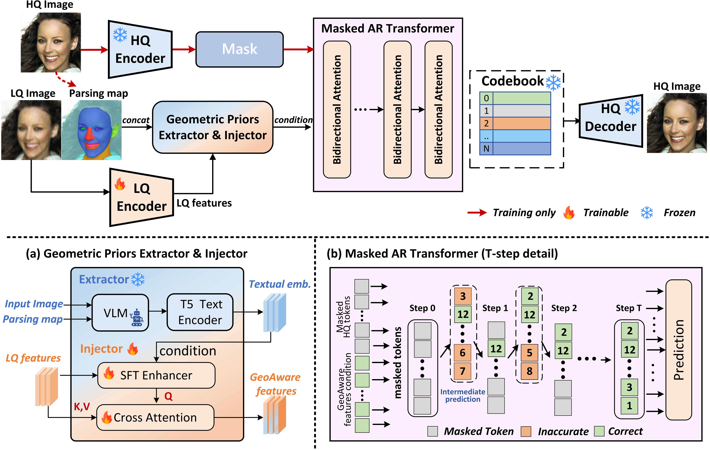

# GeoMAR: Unleashing Geometrically Aligned Features for Masked Autoregressive Blind Face Restoration

<div align="center">

[](https://doi.org/10.1145/3767308.3836198)
[](https://arxiv.org/abs/2608.03923)
[](https://arxiv.org/pdf/2608.03923)

Official PyTorch implementation of **GeoMAR**, accepted by **ACM Multimedia 2026**.


</div>


<p align="center">
  
</p>

Codebook-based blind face restoration (BFR) often suffers from ambiguous conditioning features and a fragile prediction mechanism under severe degradation. To address these challenges, we propose GeoMAR, a framework designed to unleash geometrically aligned features with masked autoregressive (MAR) refinement for robust face restoration. For feature conditioning, we introduce a dual-input extraction pipeline to extract component-based geometric descriptions with explicit, spatially faithful anchors. These textual priors are integrated with low-quality (LQ) features via an Aligned Geometric Priors Injector, which employs a KV-Q exchange strategy to generate geometrically aligned features. For prediction mechanism, we reformulate the one-step mapping into a multi-step MAR process. This coarse-to-fine generation progressively refines complex facial regions based on increasingly reliable context. Experiments on one synthetic and three real-world benchmarks demonstrate that GeoMAR achieves highly competitive perceptual quality and coherent visual structures compared with existing methods.


## Environment

The released code follows the PyTorch Lightning 1.0.x stack used by its codebook-based restoration backbone. A compatible setup is:

```bash
conda create -n geomar python=3.8 -y
conda activate geomar

pip install torch==1.10.1+cu113 torchvision==0.11.2+cu113 \
    --extra-index-url https://download.pytorch.org/whl/cu113
pip install -r requirements.txt
```

The optional prompt-generation and text-feature encoding scripts use Qwen3-VL and T5-Large, respectively. Run them in a separate, up-to-date environment:

```bash
pip install transformers accelerate qwen-vl-utils sentencepiece
```

## Data Preparation

### Training data

GeoMAR is trained on [FFHQ](https://github.com/NVlabs/ffhq-dataset). Resize the original images to `512 × 512`, then update `data.params.train.params.dataroot_gt` in `configs/GeoMAR.yaml`.

```text
datasets/
└── FFHQ512x512/
    ├── 00000.png
    ├── 00001.png
    └── ...
```

### Evaluation data

Testing Dataset:

Please put the following datasets in the ./datasets/ folder.

| Dataset | Short description | Download | Text features |
| --- | --- | --- | --- |
| CelebA-Test (HQ) | 3,000 HQ ground-truth images for evaluation | — | — |
| CelebA-Test-144 (LQ) | 3,000 synthetic LQ images for testing | — | — |
| CelebA-Test-267 (LQ) | 3,000 synthetic LQ images for testing | — | — |
| LFW-Test (LQ) | 1,711 real-world images for testing | — | — |
| WebPhoto-Test | 407 real-world images for testing | — | — |
| WIDER-Test (LQ) | 970 real-world images for testing | — | — |


## Models and Priors

Pretrained checkpoints and prepared geometric text features will be released. The expected layout is:

```text
experiments/
├── HQ_codebook.ckpt
├── LQ_codebook.ckpt
├── GeoMAR_model.ckpt
└── pretrained_models/
    ├── FFHQ_eye_mouth_landmarks_512.pth
    ├── inception_FFHQ_512-f7b384ab.pth
    ├── arcface_resnet18.pth
    └── lpips/
        └── vgg.pth
```

Component-level descriptions can be generated from RGB images and facial parsing maps with:

```bash
python generate_face_descriptions.py \
    path/to/rgb_images \
    path/to/parsing_maps \
    path/to/output_prompts
```
First, generate one .txt description for each input image. Then encode the descriptions with T5-Large:
```bash
python encode_text_features.py \
--text-folder path/to/text-folder \
--output-folder path/to/output-folder
```
For an image named 00001.png, the description should be 00001.txt and the encoded feature will be 00001_text.pt. Pass the feature directory through model.params.eval_text_features_dir when testing.


## Test

If you put the model and dataset folder properly, you can use the following command:
```bash
bash run_test_and_evaluation.sh
```

to obtain the results.

Or you can modify the following script:
```bash
sh scripts/test.sh
```
Or you can use the following command for testing:
```bash
python -u scripts/test.py \
--outdir $outdir \
-r $checkpoint \
-c $config \
--test_path $align_test_path \
--aligned \
model.params.eval_text_features_dir="$eval_text_features_dir"
```


## Training

1. Download or train the HQ and LQ codebook checkpoints.
2. Prepare FFHQ images, component landmarks, and geometric text embeddings.
3. Launch training:

```bash
python -u main_GeoMAR.py \
    --root-path ./experiments \
    --base configs/GeoMAR.yaml \
    --train True \
    --gpus 0,1,2,3, \
    --num-nodes 1
```

The default configuration uses `512 × 512` images and a batch size of 4. Adjust the GPU list, batch size, number of workers, and paths for your system.

## Evaluation

Metric scripts are provided in `scripts/metrics/`. Example commands:

```bash
bash scripts/metrics/run.sh
```
```bash
python scripts/metrics/cal_lmd.py \
        --gt_dir ./datasets/celeba_512_validation \
        --methods GeoMAR:./results/GeoMAR_celeba_test_144/restored_faces \
        --out_dir ./results/metrics/lmd \
        --device cuda
```

## Acknowledgements

This repository builds upon several excellent open-source projects, including [DAEFR](https://github.com/liagm/DAEFR), [CodeFormer](https://github.com/sczhou/CodeFormer), [MaskGIT](https://github.com/google-research/maskgit), [Taming Transformers](https://github.com/CompVis/taming-transformers), [BasicSR](https://github.com/XPixelGroup/BasicSR), and [facexlib](https://github.com/xinntao/facexlib). We sincerely thank their authors and contributors.

## Citation

If you find this work useful, please consider citing:

```bibtex
@inproceedings{gan2026geomar,
  title     = {GeoMAR: Unleashing Geometrically Aligned Features for Masked Autoregressive Blind Face Restoration},
  author    = {Gan, Lu and Yan, Hanyu and Chen, Chaofeng and Hu, Junqi and Zeng, Dan},
  booktitle = {Proceedings of the 34th ACM International Conference on Multimedia},
  year      = {2026}
}
```
